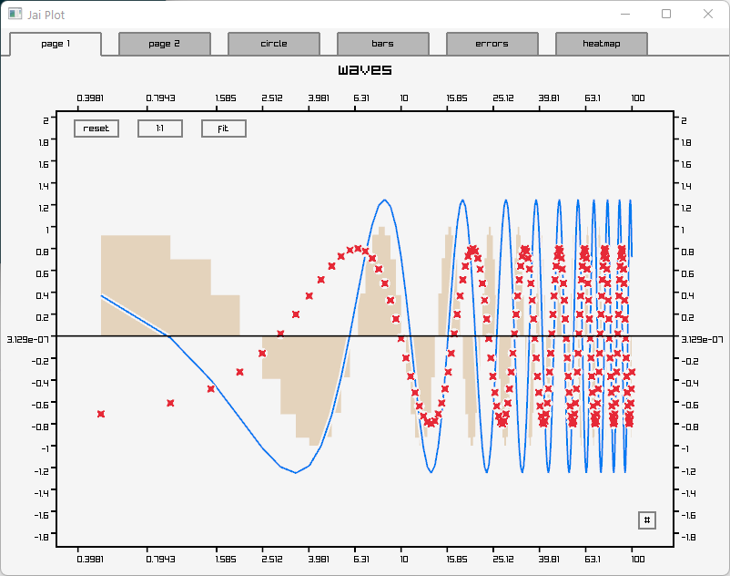
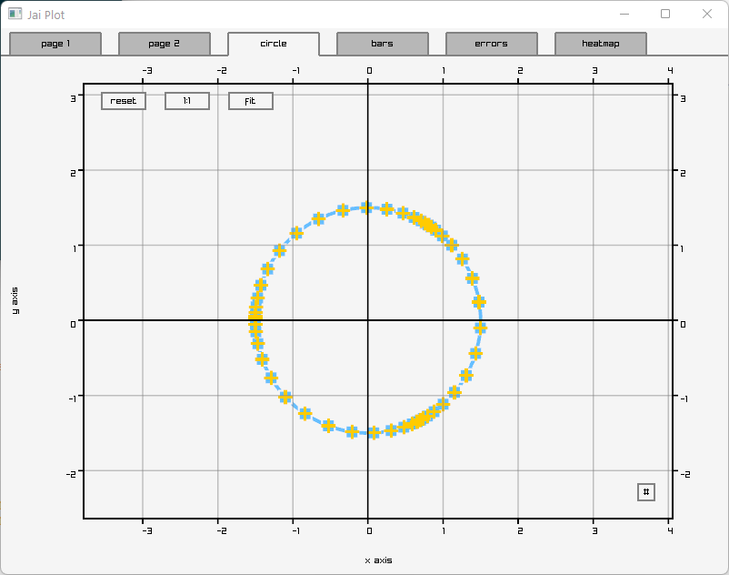
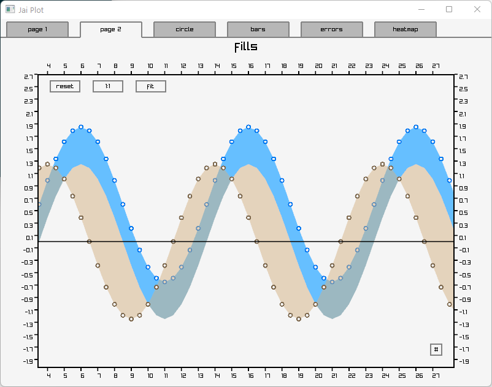
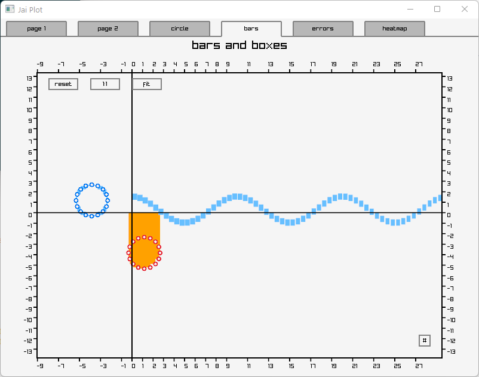
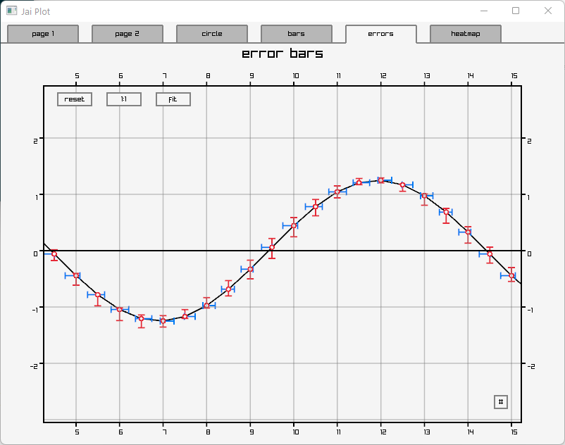
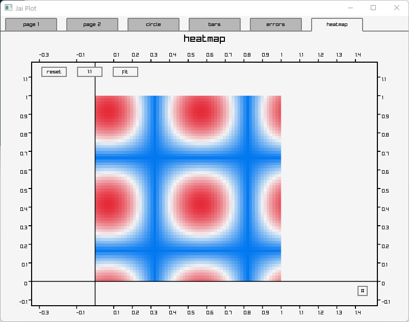

# Jai-Plot

A simple scientific plotting tool written in and for use with [Jai](https://github.com/Jai-Community/Jai-Community-Library/wiki).

See `main.jai` for examples on how to use.

## Screenshots

